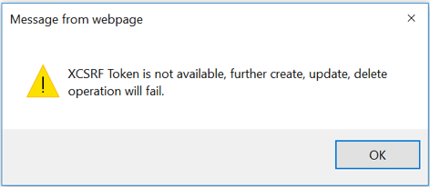
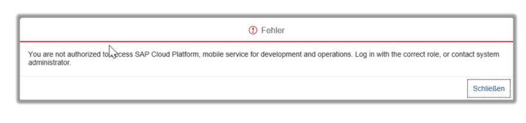

# Troubleshooting

This file contains instructions to handle possible pitfalls you might face when setting up the sample app.

## Access to the Development & Operation Service from the SAP Cloud Platform

In some cases, access to the **Development & Operations** service might be denied. The screenshots below display possible errors that might occur.

 
 

Your SAP Business Technology Platform (BTP) user is not authorized to access the Development & Operations service. The following step-by-step guide explains how to fix this issue and how to receive the authorization to access the service.

### Procedure to Authorize for Access the Development & Operations Service

1.    Navigate to the *Development & Operations* service on SAP Business Technology Platform (BTP) and choose *Configure Development & Operations*.
2.    In the dialog box, choose *Roles*.
3.    Under *Roles*, in the New Role section, choose the *Administrator* entry. In the *Administrator* section, choose *Assign*.
4.    A dialog box opens. Enter the User ID of the user that is not authorized to access the *Development & Operations* service. Choose *Assign*. Notice, that user should be the intended SAP Business Technology Platform (BTP) Administrator user.
        > **NOTE:** The User who you assign, should have ideally the role of an administrator.
5.    Shut down and restart your browser.
6.    Now you can access the *Development & Operations* service.
